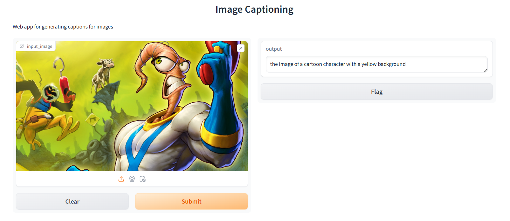

# 📸 Image Captioning Projects

Welcome to my collection of **Image Captioning** projects! 🖼️✨  
These projects use **Hugging Face's BLIP (Bootstrapping Language-Image Pretraining) model** to generate captions for images. Each project has a specific use case, from a **web app** to **automated URL captioning** and **local image organization**.

## Web app

## Automated URL captioning

## Local image organization

